# 网络安全第一次实验
## 基于 VirtualBox 的网络攻防基础环境搭建

---

### 实验目的
1. 掌握 VirtualBox 虚拟机的安装与使用；
2. 掌握 VirtualBox 的虚拟网络类型和按需配置；
3. 掌握 VirtualBox 的虚拟硬盘多重加载；

---

### 实验环境
以下是本次实验需要使用的网络节点说明和主要软件举例：
- VirtualBox 虚拟机
- 攻击者主机（Attacker）：Kali Rolling (2021.2) x64
  - Attacker 
- 网关（Gateway, GW）：Debian Buster
  - Gateway
- 靶机（Victim）：From Sqli to shell / xp-sp3 / Kali
  - Victim-XP-1
  - Victim-XP-2
  - Victim-Debian-2
---

### 实验步骤

#### 1. 加载镜像

将老师提供的 `Debian 10` 和 `Windows XP SP3` vdi文件修改为多重加载模式

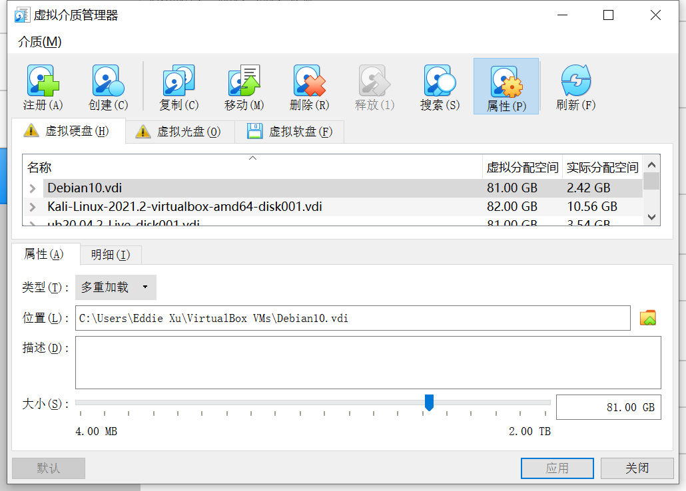

**修改方法：**

管理 -> 虚拟介质管理 -> 注册 -> 选择需要的vdi文件

下面是修改后的效果：

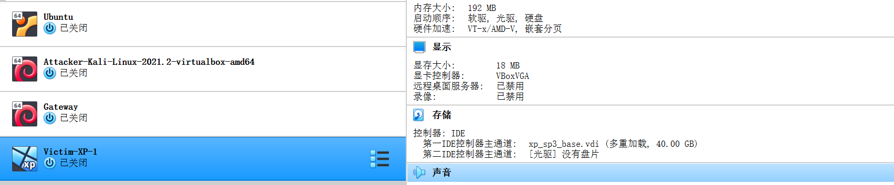

---

#### 2. 配置网络

##### `攻击者主机`配置

**网卡情况**

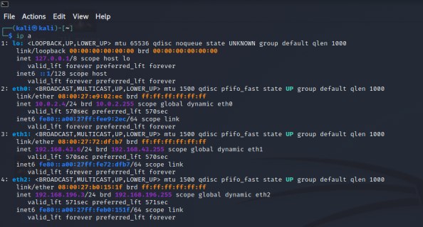

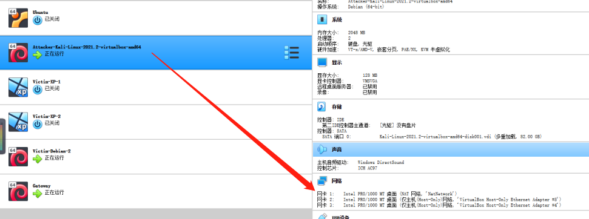

|网卡名称|VB中的网络类型|IP地址|
|:--:|:--:|:--:|
|eth0|NAT网络|10.0.2.4|
|eth1|Host-Only|192.168.43.6|
|eth2|Host-Only|192.168.196.3|

- 攻击者主机无法直接访问靶机

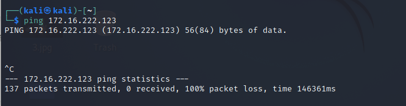
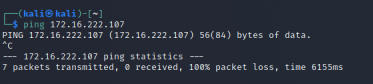

##### `网关`配置

|网卡名称|VB中的网络类型|IP地址|
|:--:|:--:|:--:|
|enp0s3|NAT网络|10.0.2.15|
|enp0s8|Host-Only|192.168.43.4|
|enp0s9|内部网络1(intnet1)|172.16.111.1|
|enp0s10|内部网络2(intnet2)|172.16.222.1|

根据网络拓扑，网关连接了三个网络：**Network-1，Network-2，NatNetwork**，所以Gateway至少需要三块网卡。

但是为了操作方便，需要一块网卡连接主机，使用ssh服务

参考 [Introduction to Networking Modes](https://www.virtualbox.org/manual/ch06.html)

- 网关连接互联网

  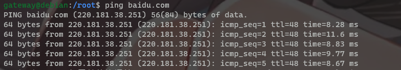

- 网关连接攻击者主机
  
  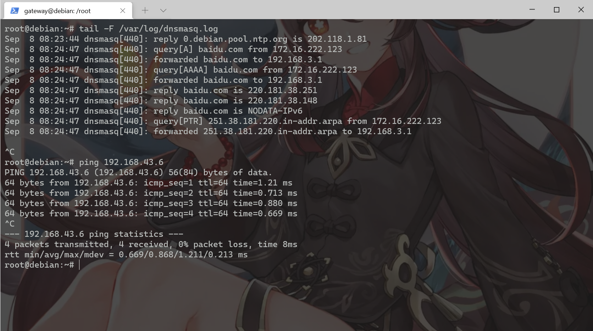

#####  `内部网络1(intnet1)` 配置

**Victim-XP-1**

|网卡名称|网络类型|IP地址|
|:--:|:--:|:--:|
|Ethernet Adapter 本地连接2|intnet1|172.16.111.113|

- Victim-XP-1 与网关的连通性
  
  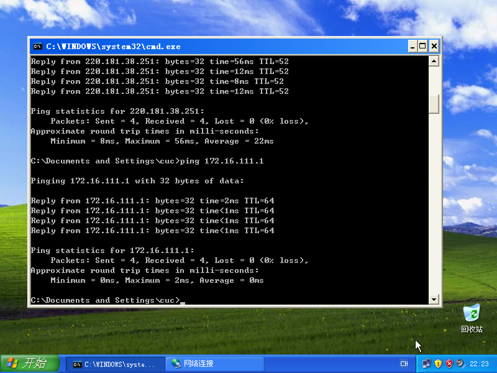

- 网关与 Victim-XP-1 的连通性  
  
  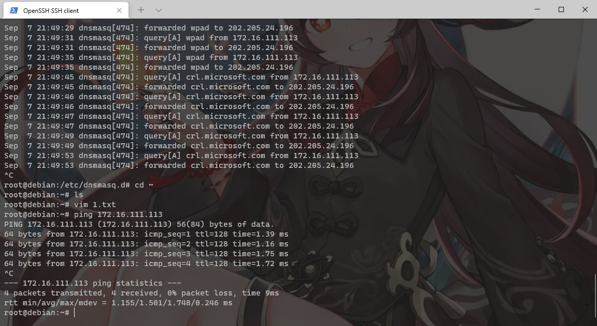

- Victim-XP-1 与网络的连通性
  
  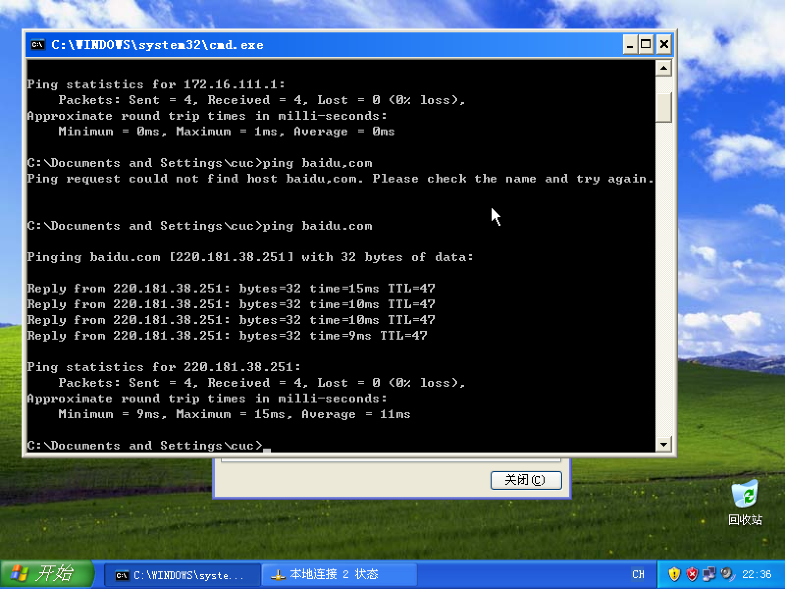
  
  网关DNS日志记录
  
  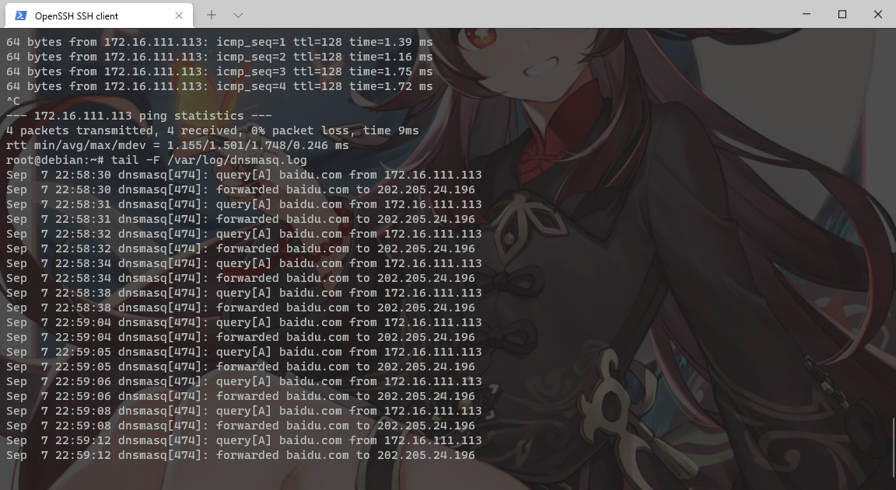

  此处可证明靶机`Victim-XP-1`对外上下行流量经过网关。同时，将网关关闭后无法连接互联网也可证明。

- 靶机`Victim-XP-1`可以直接访问攻击者主机  

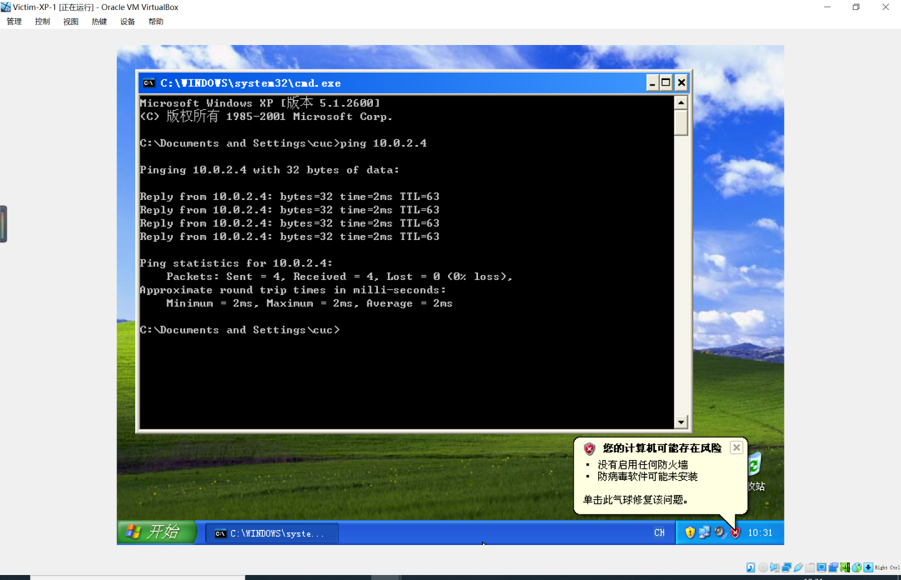

**Victim-Kali-1**

由于电脑性能原因，`victim-kali-1` 暂不进行配置

##### `内部网络2(intnet2)` 配置

**Victim-Debian-2**

|网卡名称|网络类型|IP地址|
|:--:|:--:|:--:|
|enp0s3|intnet2|172.16.222.123|

- Victim-Debian-2 与网关的相互连通性
  
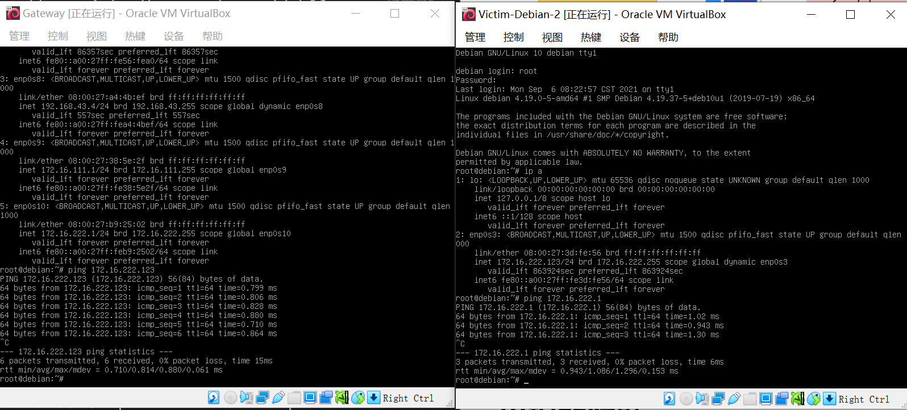

- Victim-Debian-2 与网络的连通性

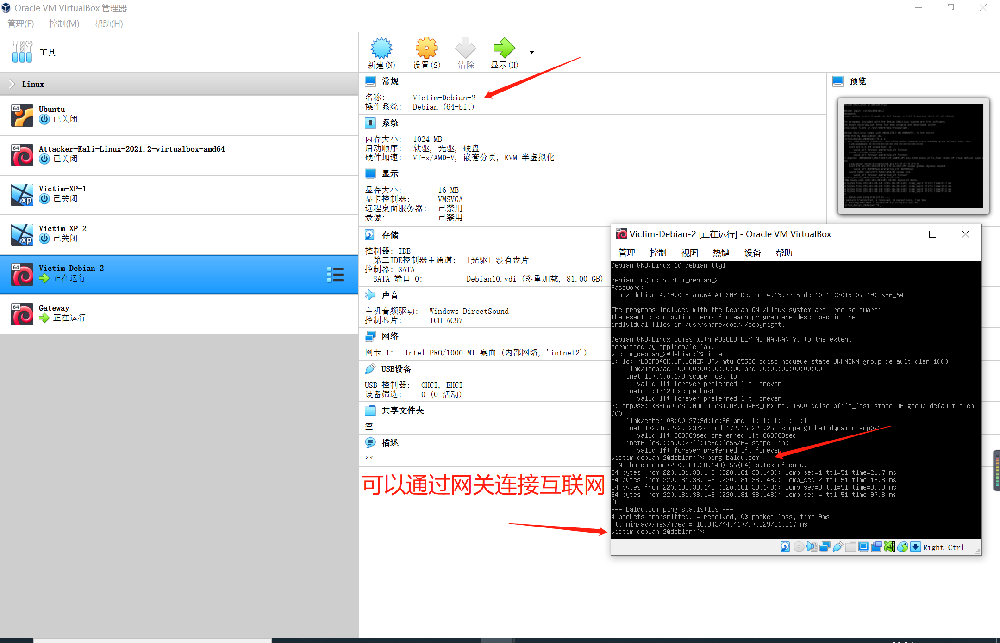

  网关DNS日志记录
  
  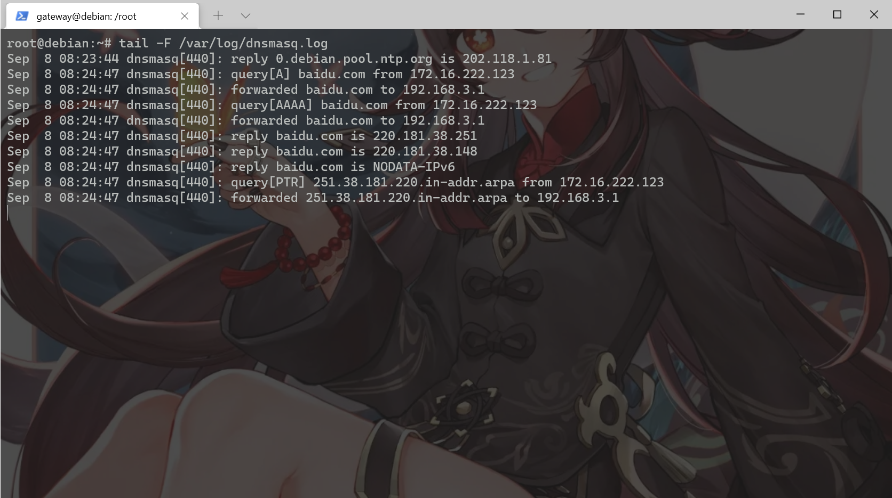

  此处可证明靶机`Victim-Debian-2`对外上下行流量经过网关。同时，将网关关闭后无法连接互联网也可证明。

- 靶机`Victim-Debian-2`可以直接访问攻击者主机  

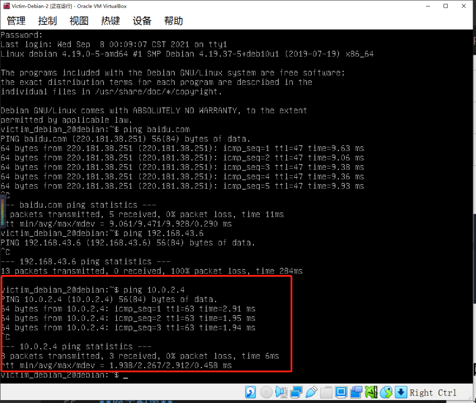

**Victim-XP-2**

|网卡名称|网络类型|IP地址|
|:--:|:--:|:--:|
|Ethernet Adapter 本地连接2|intnet2|172.16.222.107|

- Victim-XP-2 与网关的连通性
  
  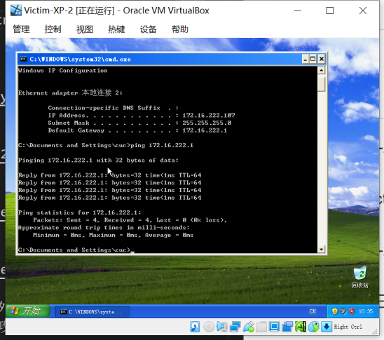

- 网关与 Victim-XP-2 的连通性  
  
  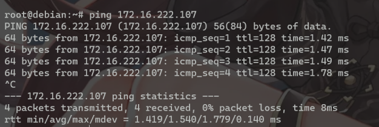

- Victim-XP-2 与网络的连通性
  
  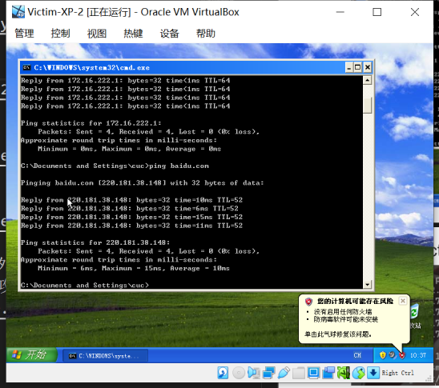
  
- 网关DNS日志记录
  
  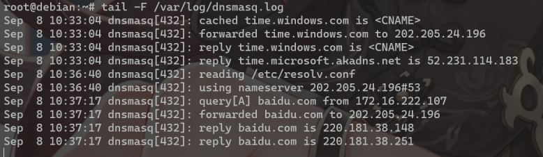

  此处可证明靶机`Victim-XP-2`对外上下行流量经过网关。同时，将网关关闭后无法连接互联网也可证明。
  
  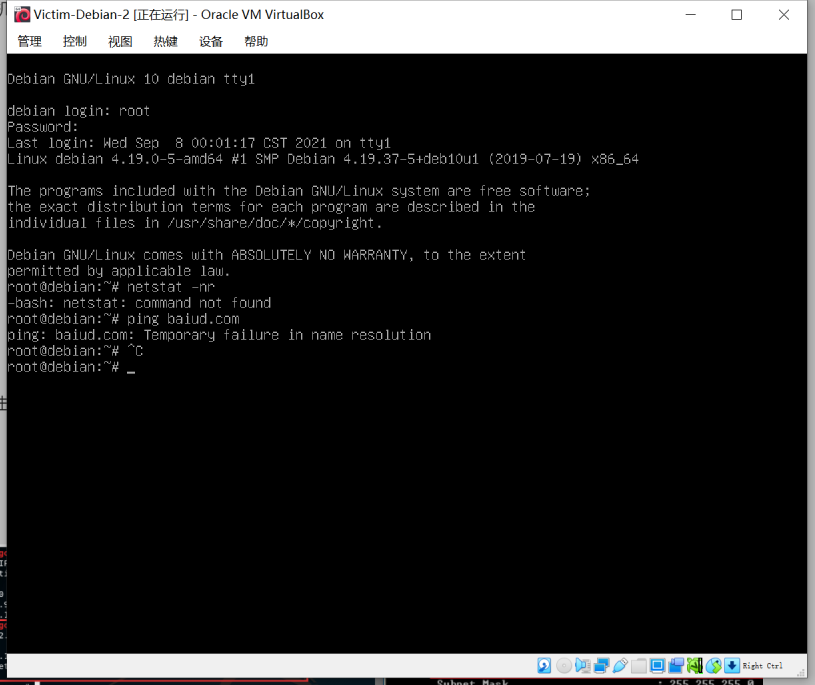

- 靶机`Victim-xp-2`可以直接访问攻击者主机  

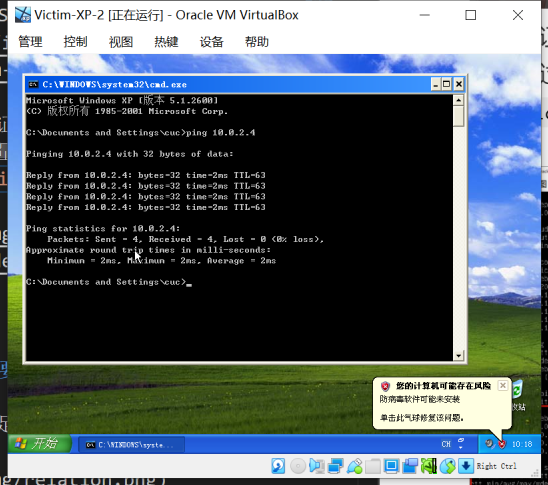

---

### 实验要求

- 搭建满足如下拓扑图所示的虚拟机网络拓扑；

**完成以下网络连通性测试**；
- [x] 靶机可以直接访问攻击者主机
- [x] 攻击者主机无法直接访问靶机
- [x] 网关可以直接访问攻击者主机和靶机
- [x] 靶机的所有对外上下行流量必须经过网关
- [x] 所有节点均可以访问互联网

---

### 出现的问题
1. ssh登录时提示「permission denied please try again」
   - 解决办法：使用`sudo vi /etc/ssh/sshd_config` 打开该文件，找到`#PermitRootLogin` 这一行，修改为 `PermitRootLogin yes`。然后使用`service sshd restart` 重启sshd服务器
  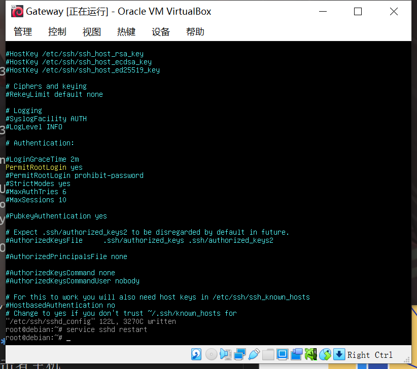
2. kali攻击机的host-only网络初始时未分配ip地址
   - 解决办法：修改配置文件 `sudo vim /etc/network/interfaces` ,将eth1，eth2这两块网卡修改为开机自启动，并且DHCP自动分配ip地址
  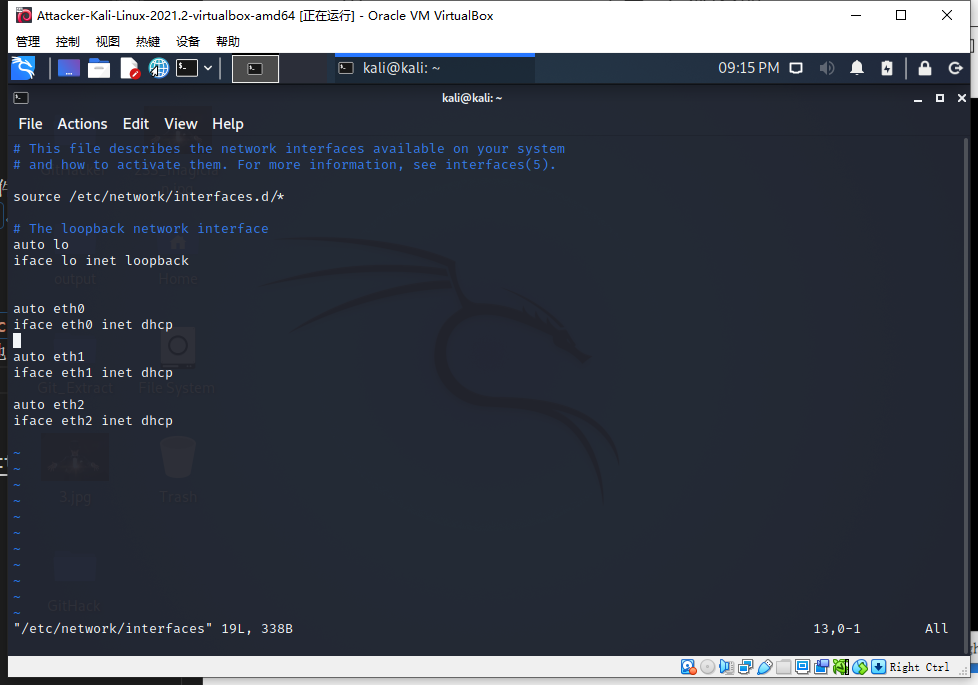
3. 靶机无法访问到攻击者主机
   - 解决办法：将网关和攻击者的`网络地址转换（NAT）网卡`修改为`NAT网络`
  这里要在全局设置中修改
  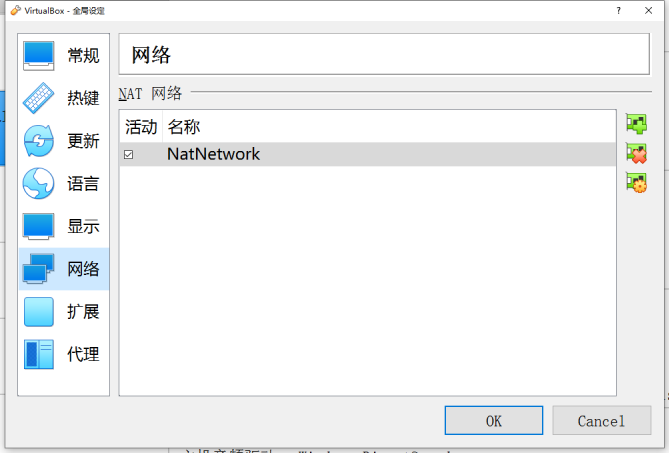
4. 网关无法访问靶机
   - 解决办法：将xp系统的防火墙关闭

---

### 参考文献
- [ssh登录时提示「permission denied please try again」](https://blog.csdn.net/donaldsy/article/details/102679413)
