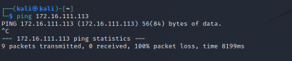

# 网络安全第一次实验
## 基于 VirtualBox 的网络攻防基础环境搭建

---

### 实验目的
1. 掌握 VirtualBox 虚拟机的安装与使用；
2. 掌握 VirtualBox 的虚拟网络类型和按需配置；
3. 掌握 VirtualBox 的虚拟硬盘多重加载；

---

### 实验环境
以下是本次实验需要使用的网络节点说明和主要软件举例：
- VirtualBox 虚拟机
- 攻击者主机（Attacker）：Kali Rolling (2021.2) x64
  - Attacker 
- 网关（Gateway, GW）：Debian Buster
  - Gateway
- 靶机（Victim）：From Sqli to shell / xp-sp3 / Kali
  - Victim-XP-1
  - Victim-XP-2
  - Victim-Debian-2
---

### 实验步骤

#### 1. 加载镜像

将老师提供的 `Debian 10` 和 `Windows XP SP3` vdi文件修改为多重加载模式

**修改方法：**

管理 -> 虚拟介质管理 -> 注册 -> 选择需要的vdi文件

下面是修改后的效果：

---

#### 2. 配置网络

##### `攻击者主机`配置

**网卡情况**

|网卡名称|VB中的网络类型|IP地址|
|:--:|:--:|:--:|
|eth0|NAT网络|10.0.2.4|
|eth1|Host-Only|192.168.43.6|
|eth2|Host-Only|192.168.196.3|

- 攻击者主机无法直接访问靶机

##### `网关`配置

|网卡名称|VB中的网络类型|IP地址|
|:--:|:--:|:--:|
|enp0s3|NAT网络|10.0.2.15|
|enp0s8|Host-Only|192.168.43.4|
|enp0s9|内部网络1(intnet1)|172.16.111.1|
|enp0s10|内部网络2(intnet2)|172.16.222.1|

根据网络拓扑，网关连接了三个网络：**Network-1，Network-2，NatNetwork**，所以Gateway至少需要三块网卡。

但是为了操作方便，需要一块网卡连接主机，使用ssh服务

参考 [Introduction to Networking Modes](https://www.virtualbox.org/manual/ch06.html)

- 网关连接互联网

  

- 网关连接攻击者主机
  
  

#####  `内部网络1(intnet1)` 配置

**Victim-XP-1**

|网卡名称|网络类型|IP地址|
|:--:|:--:|:--:|
|Ethernet Adapter 本地连接2|intnet1|172.16.111.113|

- Victim-XP-1 与网关的连通性
  
  

- 网关与 Victim-XP-1 的连通性  
  
  

- Victim-XP-1 与网络的连通性
  
  
  
  网关DNS日志记录
  
  

  此处可证明靶机`Victim-XP-1`对外上下行流量经过网关。同时，将网关关闭后无法连接互联网也可证明。

- 靶机`Victim-XP-1`可以直接访问攻击者主机  

**Victim-Kali-1**

由于电脑性能原因，`victim-kali-1` 暂不进行配置

##### `内部网络2(intnet2)` 配置

**Victim-Debian-2**

|网卡名称|网络类型|IP地址|
|:--:|:--:|:--:|
|enp0s3|intnet2|172.16.222.123|

- Victim-Debian-2 与网关的相互连通性
  

- Victim-Debian-2 与网络的连通性

  网关DNS日志记录
  
  

  此处可证明靶机`Victim-Debian-2`对外上下行流量经过网关。同时，将网关关闭后无法连接互联网也可证明。

- 靶机`Victim-Debian-2`可以直接访问攻击者主机  

**Victim-XP-2**

|网卡名称|网络类型|IP地址|
|:--:|:--:|:--:|
|Ethernet Adapter 本地连接2|intnet2|172.16.222.107|

- Victim-XP-2 与网关的连通性
  
  

- 网关与 Victim-XP-2 的连通性  
  
  

- Victim-XP-2 与网络的连通性
  
  
  
- 网关DNS日志记录
  
  

  此处可证明靶机`Victim-XP-2`对外上下行流量经过网关。同时，将网关关闭后无法连接互联网也可证明。
  
  

- 靶机`Victim-xp-2`可以直接访问攻击者主机  

---

### 实验要求

- 搭建满足如下拓扑图所示的虚拟机网络拓扑；

**完成以下网络连通性测试**；
- [x] 靶机可以直接访问攻击者主机
- [x] 攻击者主机无法直接访问靶机
- [x] 网关可以直接访问攻击者主机和靶机
- [x] 靶机的所有对外上下行流量必须经过网关
- [x] 所有节点均可以访问互联网

---

### 出现的问题
1. ssh登录时提示「permission denied please try again」
   - 解决办法：使用`sudo vi /etc/ssh/sshd_config` 打开该文件，找到`#PermitRootLogin` 这一行，修改为 `PermitRootLogin yes`。然后使用`service sshd restart` 重启sshd服务器
  
2. kali攻击机的host-only网络初始时未分配ip地址
   - 解决办法：修改配置文件 `sudo vim /etc/network/interfaces` ,将eth1，eth2这两块网卡修改为开机自启动，并且DHCP自动分配ip地址
  
3. 靶机无法访问到攻击者主机
   - 解决办法：将网关和攻击者的`网络地址转换（NAT）网卡`修改为`NAT网络`
  这里要在全局设置中修改
  
4. 网关无法访问靶机
   - 解决办法：将xp系统的防火墙关闭

---

### 课后思考题

1. 以下⾏为分别破坏了CIA和AAA中哪⼀个属性或多个属性？

* 小明抄小强的作业：CIA：机密性 AAA：认证、授权
* 小明把小强的系统折腾死机了:CIA：可用性 AAA：授权
* 小明修改了小强的淘宝订单:CIA：完整性、机密性 AAA：认证、授权
* 小明冒充小强的信用卡账单签名:CIA：完整性 AAA：认证、授权
* 小明把自⼰电脑的IP修改为小强电脑的IP，导致小强的电脑⽆法上⽹:CIA：可用性 AAA：认证、授权

2. 有⼀次，小明⼝袋里有100元，因为打瞌睡，被小偷偷⾛了，搞得晚上没饭吃。又⼀天，小明⼝袋里有200元，这次小明为了防范小偷，不打瞌睡了，但却被强盗持⼑威胁抢⾛了，搞得⼀天没饭吃，小明当天就报警了。

* 试分析两次失窃事件中的：风险、资产、威胁、弱点、攻击、影响
  ||风险|资产|威胁|弱点|攻击|影响| 
  |:--:|:--:|:--:|:--:|:--:|:--:|:--:|
  |第一次失窃|钱被偷走|100元|小偷|人会困|偷窃|没饭吃|
  |第二次失窃|钱被抢走|200元|持刀强盗|被刀捅人会受伤|持刀抢劫|没饭吃|
* 试用P2DR模型分析以上案例中的“现⾦被抢”事件中的安全策略、安全防护、安全检测和安全响应
  ||安全策略|安全防护|安全检测|安全响应| 
  |:--:|:--:|:--:|:--:|:--:|
  |第一次失窃|物理安全策略|放在身上藏着|无检测|无响应|
  |第二次失窃|物理安全策略，入侵检测|保持清醒，放在身上藏着|检测钱是否还在身上|报警|
* “被抢”事件中，小明的安全策略存在何问题？
  - 安全策略中的安全假设存在问题：`安全机制能够强制保证系统不会进入“不安全”状态。`这一点不成立，即强盗会强行抢走钱财

3. 针对下述论点，分别设计⼀场景案例（必须和课程相关），使得该论点在该场景中成立

- 预防比检测和恢复更重要
  - 某网站保存用户名和密码的数据库，其安全防护手段等要定期更新，让攻击者尽量无法攻击。被攻击后恢复也无济于事了
- 检测比预防和恢复更重要
  - 蜜罐和蜜网
- 恢复比预防和检测更重要
  - 某一系统处于断网环境或是内网环境，存有重要信息。信息的恢复相比于另外两点更加重要

4. 试分析“CAPTCHA图片验证码技术可以阻⽌恶意批量注册⾏为”这句话中的安全策略、安全机制和安全假设分别是什么？CAPTCHA图片举例

- 安全策略：访问控制策略。

- 安全机制：设置具有一定难度验证码，只有验证码正确才能被授权进行注册。
  
- 安全假设：因为验证码具有一定难度，只有真人才能对验证码进行计算；程序、恶意代码等难以进行识别与计算，从而达到防止批量注册的目的。（In a word: 程序无法正确识别验证码）

5. 某⼤型软件开发公司的总裁担⼼公司的专利软件设计⽅法被内部员⼯泄露给其他公司，他打算防⽌泄密事件的发⽣。于是他设计了这样⼀个安全机制： **所有员⼯必须每天向他汇报自⼰和其他竞争对⼿公司员⼯的所有联系(包括IM、电⼦邮件、电话等等)** 。你认为该安全机制能达到总裁的预期安全效果吗？为什么？

- 不能达到总裁的预期安全效果
- 原因：
  - 安全策略的集合不能够实现所有的安全策略：员工与竞争对手公司的联系可能并不局限于IM、电⼦邮件、电话等等，并且可能不止员工有泄密可能，管理层也存在泄密的可能；
  - 安全机制的实现存在纰漏：不一定能够获得员工与其他人的联系，即使获得联系也不一定能够确定信息的真实性；

---

### 参考文献
- [ssh登录时提示「permission denied please try again」](https://blog.csdn.net/donaldsy/article/details/102679413)
