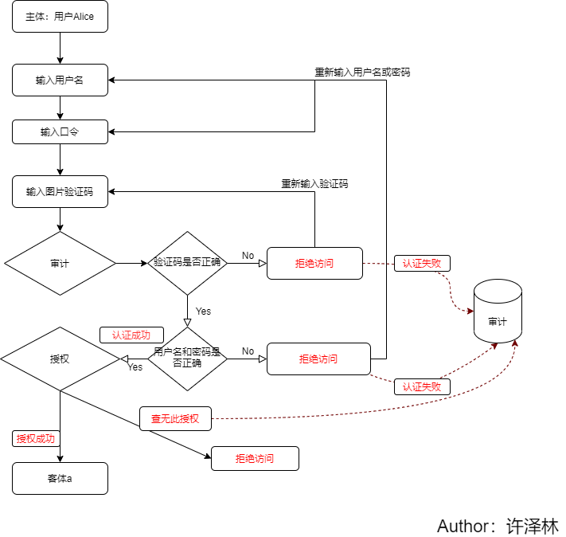
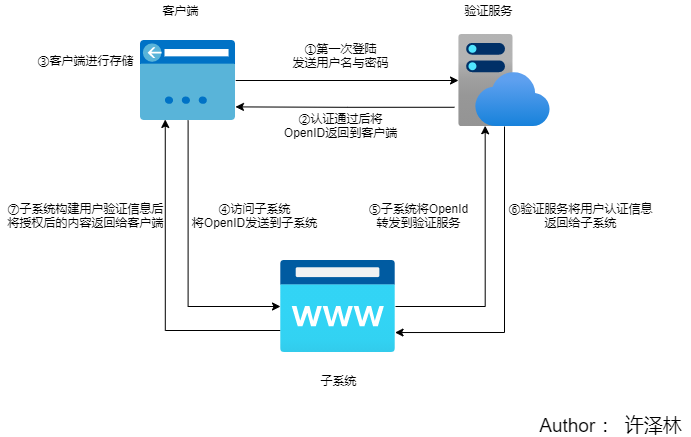

# 网络安全第一次实验

**目录**

[toc]

## 操作系统的访问控制设计实例研究

* 以 `Harmony鸿蒙` 系统为研究对象
    * 实验环境
        * 操作系统版本：2.0.0
        * 版本号：2.0.0.165(C00E160R2P6patch03) GPU Turbo
        * 硬件设备型号：HMA-AL00 （Mate 20）
        
    * 当系统处于锁屏状态下接收到新短信时，不解锁情况下
        * 系统是否允许查看短信内容？**不允许**【本来想截屏，但发现未解锁的情况下无法截屏】
        * 系统是否允许回复短信？**不允许**
        * 安卓上的 App : 以 ***微信电话本*** 为例，在接管了系统短信功能和权限之后，是否会有一些不同的功能设定? **无微信电话本功能**
        
    * 当系统处于锁屏状态下，使用系统内置（例如 iOS 的 Siri ）或第三方的语音助手可以完成以下哪些操作？

        ​	以下所有操作都需要语音助手对说话人进行声纹识别，非机主不能进行唤起。

        * 访问通讯录：不能访问通讯录，需要解锁手机
        * 拨打电话：可以拨打电话
        * 访问相册：不能访问相册，需要解锁手机
        * 查看短信收件箱：不能查看收件箱，需要解锁手机

    * 如果你的手机支持指纹识别解锁手机，请实验并分析指纹识别相比较于简单密码、复杂密码、图形解锁、人脸识别解锁、声纹解锁等解锁方式的安全性、便利性差异。

| 【相比于指纹识别】 |    简单密码    |      复杂密码      |                        图形解锁                        |                       人脸识别解锁                       |                 声纹解锁                 |
| :----------------: | :------------: | :----------------: | :----------------------------------------------------: | :------------------------------------------------------: | :--------------------------------------: |
|       安全性       |  指纹识别更强  | 复杂密码安全性更高 |         图形解锁存在图案简单，可能被偷窥的可能         |                          差不多                          | 声纹解锁安全性更高但是辨别准确度存在问题 |
|       便利性       | 指纹识别更便利 |   指纹识别更便利   | 图形更便利（在手指非干燥条件下，指纹通常无法正确识别） | 指纹识别更便利（以亲身经历来说，人脸识别解锁准确率较低） |              指纹识别更便利              |

---

## 课后思考

### 1.  生物特征身份认证方式有哪些？优缺点分析？应用场景举例。

    - 声音：声纹识别
        - 优点：
            1. 蕴含声纹特征的语音获取方便、自然；
            2. 获取语音的成本低廉，使用简单，像麦克风、通讯设备等皆可；
            3. 适合远程身份确认；
            4. 声纹辨认和确认的算法复杂度低；
            5. 配合一些其他措施，如通过语音识别进行内容鉴别等，可以提高准确率。
        - 缺点：
            1. 同一个人的声音具有易变性，易受身体状况、年龄、情绪等的影响
            2. 不同的麦克风和信道对识别性能有影响；
            3. 环境噪音对识别有干扰；
            4. 混合说话人的情形下人的声纹特征不易提取；
            5. 当人感冒，咽喉发炎等情况声带特性会发生变化而导致识别障碍
        - 应用场景：
            
    - 脸：人脸识别
        - 优点：
            1. 速度快
            2. 具有“非接触性”，可以大大提升系统响应速度，同时避免指纹机器接触产生的卫生隐患
        - 缺点：
            1. 存在无法识别双胞胎的可能性
            2. 人脸的外形很不稳定，人可以通过脸部的变化产生很多表情，而在不同观察角度，人脸的视觉图像也相差很大
            3. 人脸识别受到光照影响很大，如果光线不好，也会引起识别的准确度。
        - 应用场景：
            人脸支付、电子设备解锁
    - 指纹：指纹识别
        - 优点：
            1. 指纹是人体独一无二的特征，并且它们的复杂度足以提供用于鉴别的足够特征。
            2. 如果想要增加可靠性，只需登记更多的指纹，鉴别更多的手指，最多可以达到十个，而每一个指纹都是独一无二的。
            3. 扫描指纹的速度很快，使用非常方便。
        - 缺点：
            1. 每一次使用指纹时都会在指纹采集头上留下用户的指纹印痕，而这些指纹痕迹存在被用来复制指纹的可能性。
            2. 某些人或某些群体的指纹因为指纹特征很少，故而很难成像。
            3. 在手指非干燥时，指纹识别困难
        - 应用场景：
            电子设备解锁，包括门锁、电脑、手机等
    
    - 虹膜：虹膜识别
        - 优点：
        	1. 便于用户使用；
     	    2. 可靠
     	    3. 不需物理的接触；
        - 缺点：
        	1. 很难将图像获取设备的尺寸小型化；
        	2. 设备造价高，无法大范围推广；
        	3. 镜头可能产生图像畸变而使可靠性降低；
        - 应用场景：
    		安防设备（如门禁等），以及有高度保密需求的场所
    
    - 还有体型：体形识别;个人习惯（例如敲击键盘的力度和频率、签字）：键盘敲击识别、签字识别、指静脉识别等等一系列生物特征身份认证

### 2.  “找回口令功能”和“忘记密码”在访问授权机制中的意义？请尝试设计几种安全的“找回口令功能”，详细描述找回口令的用户具体操作过程。

- 意义：

  ​	 “找回口令功能”和“忘记密码”是在真正被授权用户忘记口令时重新获取权限的方式，从而对客体能够正常访问

- “找回口令功能”方案设计：

  - 基于“双因素认证”。
  
    > 双因素认证是一种采用时间同步技术的系统，采用了基于时间、事件和密钥三变量而产生的一次性密码来代替传统的静态密码。每个动态密码卡都有一个唯一的密钥，该密钥同时存放在服务器端，每次认证时动态密码卡与服务器分别根据同样的密钥，同样的随机参数（时间、事件）和同样的算法计算了认证的动态密码，从而确保密码的一致性，从而实现了用户的认证。因每次认证时的随机参数不同，所以每次产生的动态密码也不同。由于每次计算时参数的随机性保证了每次密码的不可预测性，从而在最基本的密码认证这一环节保证了系统的安全性。解决因口令欺诈而导致的重大损失，防止恶意入侵者或人为破坏，解决由口令泄密导致的入侵问题。
  
    安全假设是用户有一台可信任设备(比如用户的手机、USB KEY等),在用户使用找回口令功能的时候，服务器能够向可信任设备发送一个动态密码，只有用户在网页上输入该动态密码才能进行口令更改。
  
    
  
    注：此处动态密码可根据成本进行更换，包括：手机短信密码、混合型令牌（USBKEY+[动态口令](https://baike.baidu.com/item/动态口令)）等

### 3.  绘制用户使用用户名/口令+图片验证码方式录系统的流程图。考虑认证成功和失败两种场景，考虑授权成功和失败两种场景。

### 4. Windows XP / 7 中的访问控制策略有哪些？访问控制机制有哪些？

   **Windows xp/7**：

   - 访问控制策略：
      - 基于角色的访问控制
          在Windows XP中，有一群不为人知的用户，它们的作用是可以让我们指派权限到某种"状态"的用户(如"匿名用户"、"网络用户")等，而不是某个特定的用户或组(如 "zhong"、"CPCW"这类用户)。这样一来，对用户权限的管理就更加容易精确控制了。这群用户在Windows XP中，统一称为**内置安全主体**。

     > Windows XP对访问控制方面的策略做了较多的改进。主要有，限制网络用户为来宾账号的策略，空口令限制策略，借助Microsoft Passport实现的单一登录方式，针对漫游用户的凭证管理等。例如，凭证管理特性为包括密码和X.509证书在内的用户凭证提供了安全的存储方式。该特性为包括漫游用户在内的所有用户提供了一致性的单一签名体验。如果用户需要访问公司网络中的一个应用程序，那么，在首次进行尝试时，用户需要进行身份验证，并根据提示信息提供一个凭证。在提供该凭证后，它将与所请求的应用程序建立关联。今后，当用户再次访问该应用程序时，原先所保存的凭证将在无需重新输入的情况下再次使用。
     
        - 强制访问控制
     
           用户在登陆时，登陆主机的系统首先把用户输入的用户名等信息传送给安全账号管理器，安全账号管理器将这些信息与SAM数据库中的信息进行比较。比较结果，如果匹配，服务器发给工作站允许访问的信息，并返回用户的安全标识，每次用户对系统进行操作时，系统都会将用户的SID与安全描述符中的自主访问控制表进行比较，从而决定用户是否有权访问对象。
     
   - 访问控制机制

      - 系统为共享资源创建的安全描述符包含了该对象的一组安全属性：1. 所有者安全标识。2. 组安全标识。3. 自主访问控制表（DAC）4. 系统访问控制表（ACL）

### 5.  用权限三角形模型来理解并描述下 2 种威胁模型：提权、仿冒。

提权：

水平权限提升举例：

>  我们假设攻击者已经获得了在线银行账户的访问权限。她的目的是窃取金钱，但她从这一个账户中窃取的金钱并不多。这时，她就会寻找信息或尝试[各种漏洞利用途径](https://www.exploit-db.com/webapps/)来获得对其他账户的访问权限。这称之为*水平权限提升*，因为攻击者是在具有相似权限的账户中横向移动。她是如何横向移动的？攻击者可以在她登录后检查该银行返回的超链接，查看是否透露有关内容在该银行网站上的组织方式的任何信息。她可能会发现银行以特定方式在超链接中编码客户的账号。这时，她就会编写并在网址中插入超链接，以测试银行系统的安全是否存在缺陷以及是否可以利用该缺陷查看其他客户的账户数据或（更严重情形）转移资金。如果成功的话，她可以在银行检测到其活动或客户报告失窃之前访问多个账户。这称之为*直接对象引用*[技术](https://www.outpost24.com/direct-object-references-and-horizontal-privilege-escalation/)。

​	

纵向权限提升举例：

> 攻击者已经未经授权获得了在计算机系统上访问用户账户的权限。他将进行[本地侦查](https://www.admin-magazine.com/Articles/Understanding-Privilege-Escalation)，查看遭到攻击的用户可以做什么和他可以访问什么信息，他是否可以从该账户编写脚本或编译程序等等。如果他能够在遭到攻击的计算机上下载和执行软件，他就可以运行恶意软件。他将到处侦查，直到发现可以加以利用的漏洞或配置错误，以便成为目标计算机的管理员，或者他也将放弃该系统并移到另一台计算机。

仿冒：

​	仿冒就是用户A以用户B的身份进行了认证，拥有了用户B才拥有的权利。用户在系统看来角色进行了变更，相对应的权利因而发生了变化

### 6.  试通过操作系统的访问控制机制来达到预防一种真实病毒的运行目的。

​	 举例 ：特洛伊木马是一种常见的恶意软件，与病毒不同，它无法自行传播。 这意味着必须手动下载它们，或者需要下载并安装其他恶意软件。特洛伊木马通常使用与真实和合法应用相同的文件名。很容易意外下载特洛伊木马，认为它是合法应用。

**特洛伊木马如何工作**

特洛伊木马可以有许多不同的种类，但通常它们会执行以下操作：

- 下载并安装其他恶意软件，如病毒或 [蠕虫](https://docs.microsoft.com/zh-cn/windows/security/threat-protection/intelligence/worms-malware)。
- 使用受感染的设备进行点击欺诈。
- 记录所访问的键击和网站。
- 将有关受感染设备的信息发送给恶意黑客，包括密码、网站的登录详细信息和浏览历史记录。
- 让恶意黑客控制受感染的设备。

​	**预防方法**

- 认证

  在检测到执行恶意操作时需要进行身份确认（比如删除、加密硬盘中的文件）

- 授权

  对进程的权限进行限制，对每个进程主体在满足正常使用的情况下赋予最小权限，当发现恶意行为时及时撤销权限。

- 审计

  对进程进行审计，当发现向未知目标发送隐私信息等类似木马行为时终止该恶意进程。

### 7.  什么是 OAuth？

开放授权（OAuth）是一个开放标准，允许用户让第三方应用访问该用户在某一网站上存储的私密的资源（如照片，视频，联系人列表），而无需将用户名和密码提供给第三方应用。

OAuth允许用户提供一个令牌，而不是用户名和密码来访问他们存放在特定服务提供者的数据。每一个令牌授权一个特定的网站（例如，视频编辑网站)在特定的时段（例如，接下来的2小时内）内访问特定的资源（例如仅仅是某一相册中的视频）。这样，OAuth让用户可以授权第三方网站访问他们存储在另外服务提供者的某些特定信息，而非所有内容。

OAuth是OpenID的一个补充，但是完全不同的服务。

### 8.  什么是 OpenID？

一个去中心化的网上身份认证系统。对于支持OpenID的网站，用户不需要记住像用户名和密码这样的传统验证标记。
取而代之的是，他们只需要预先在一个作为OpenID身份提供者（identity provider, IdP）的网站上注册。
OpenID是去中心化的，任何网站都可以使用OpenID来作为用户登录的一种方式，任何网站也都可以作为OpenID身份提供者。
OpenID既解决了问题而又不需要依赖于中心性的网站来确认数字身份。

### 9.  试用本章所学理论分析 OAuth 和 OpenID 的区别与联系。

图源wiki：https://upload.wikimedia.org/wikipedia/commons/thumb/3/32/OpenIDvs.Pseudo-AuthenticationusingOAuth.svg/768px-OpenIDvs.Pseudo-AuthenticationusingOAuth.svg.png 

在 OpenID*身份验证*用例中，来自身份提供者的响应是身份断言；而在 OAuth*授权*用例中，身份提供者也是[API](https://en.wikipedia.org/wiki/Application_Programming_Interface)提供者，来自身份提供者的响应是一个访问令牌，可以代表用户授予应用程序对某些身份提供者 API 的持续访问权。访问令牌充当一种“代客密钥”，应用程序可以将其包含在向身份提供者发出的请求中，这证明它已获得用户的访问这些[API 的](https://en.wikipedia.org/wiki/Application_Programming_Interface)许可。

### 10.  如何使用 OAuth 和 OpenID 相关技术实现单点登录（Single Sign On）？

1. 当用户第一次登录时，将用户名密码发送给用户服务
2. 验证用户将用户标识OpenId返回到客户端
3. 客户端进行存储
4. 访问子系统,将OpenId发送到子系统
5. 子系统将OpenId转发到验证服务
6. 验证服务将用户认证信息返回给子系统
7. 子系统构建用户验证信息后将授权后的内容返回给客户端

---

## 参考资料

- [开放授权（OAuth）](https://zh.wikipedia.org/wiki/%E5%BC%80%E6%94%BE%E6%8E%88%E6%9D%83)
- [OpenID](https://zh.wikipedia.org/wiki/OpenID)
- [Windows XP到底有多安全？](http://tech.sina.com.cn/c/2001-12-29/8189.html)
- [Apple ID 的双重认证](https://support.apple.com/zh-cn/HT204915)
- [用户、角色、权限的三角恋](https://blog.csdn.net/Cloudox_/article/details/52527609)
- [被“incaseformat”蠕虫病毒删除文件？不要慌，腾讯iOA、御点、管家都能杀，文件也能恢复](https://guanjia.qq.com/news/n3/2586.html)
- [单点登录（SSO）看这一篇就够了](https://developer.aliyun.com/article/636281)
- [访问控制技术与Windows访问控制](https://wenku.baidu.com/view/ab8b4e2b453610661ed9f4aa.html)

