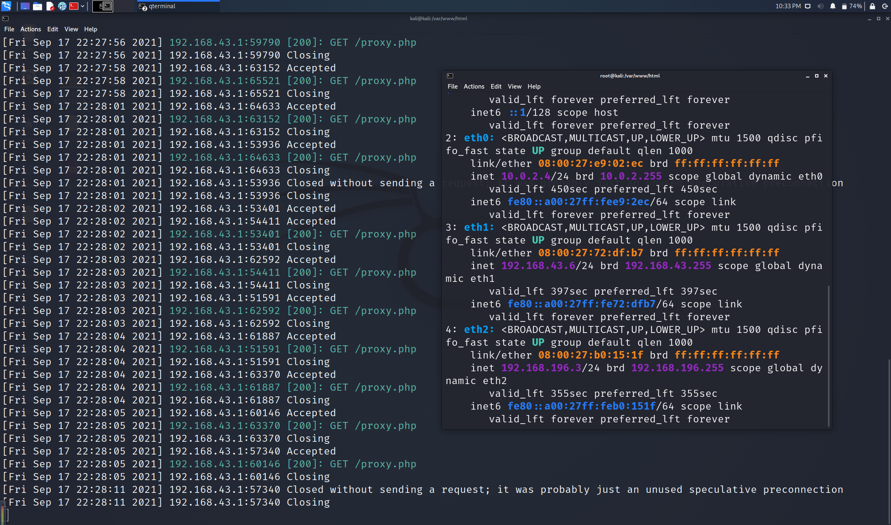

# 网络安全第三次实验

## HTTP代理服务器实验

---

## 课内实验

### 1. 本地代理模拟小实验

```php
<?php
var_dump($_SERVER);
```

```bash
php -S 0.0.0.0:8080
```

```
┌──(root💀kali)-[/var/www/html]
└─# curl -H "X-Forwarded-For: 8.8.8.8" http://127.0.0.1:8080/proxy.php
array(18) {
  ["DOCUMENT_ROOT"]=>
  string(13) "/var/www/html"
  ["REMOTE_ADDR"]=>
  string(9) "127.0.0.1"
  ["REMOTE_PORT"]=>
  string(5) "45480"
  ["SERVER_SOFTWARE"]=>
  string(29) "PHP 7.4.15 Development Server"
  ["SERVER_PROTOCOL"]=>
  string(8) "HTTP/1.1"
  ["SERVER_NAME"]=>
  string(7) "0.0.0.0"
  ["SERVER_PORT"]=>
  string(4) "8080"
  ["REQUEST_URI"]=>
  string(10) "/proxy.php"
  ["REQUEST_METHOD"]=>
  string(3) "GET"
  ["SCRIPT_NAME"]=>
  string(10) "/proxy.php"
  ["SCRIPT_FILENAME"]=>
  string(23) "/var/www/html/proxy.php"
  ["PHP_SELF"]=>
  string(10) "/proxy.php"
  ["HTTP_HOST"]=>
  string(14) "127.0.0.1:8080"
  ["HTTP_USER_AGENT"]=>
  string(11) "curl/7.74.0"
  ["HTTP_ACCEPT"]=>
  string(3) "*/*"
  ["HTTP_X_FORWARDED_FOR"]=>
  string(7) "8.8.8.8"
  ["REQUEST_TIME_FLOAT"]=>
  float(1631934120.3146)
  ["REQUEST_TIME"]=>
  int(1631934120)
}

```

虚拟机的ip地址为 `192.168.43.6`,左侧为网站流量记录



宿主机访问虚拟机开启的8080端口的网站


可以看到宿主机访问时的相关信息，并且每次刷新的时候宿主机使用的端口会变


### 2. 使用tinyproxy代理服务时的请求头情况


```bash
sudo update && sudo apt install tinyproxy

systemctl start tinyproxy

curl -x http://127.0.0.1:8888 http://127.0.0.1:8080/proxy.php
```


```
# 在客户端请求头中加入客户端真实 IP
sed -i.bak "s/#XTinyproxy Yes/XTinyproxy Yes/" /etc/tinyproxy/tinyproxy.conf

# 重启 tinyproxy 服务
systemctl restart tinyproxy

# 在独立 shell 窗口开启 tinyproxy 日志监控小程序
tail -F /var/log/tinyproxy/tinyproxy.log

# 访问 HTTPS 站点
curl -x http://127.0.0.1:8888 https://auth.alipay.com/login/index.htm

# 查看 HSTS 响应头
curl -I -x http://127.0.0.1:8888 https://auth.alipay.com/login/index.htm

┌──(root💀kali)-[/var/www/html]
└─# curl -I -x http://127.0.0.1:8888 https://auth.alipay.com/login/index.htm
HTTP/1.0 200 Connection established
Proxy-agent: tinyproxy/1.10.0

HTTP/2 302 
server: nginx/1.6.2
date: Sat, 18 Sep 2021 05:26:44 GMT
content-length: 0
location: https://authsa127.alipay.com:443/error.htm?exception_marking=the+requestMethod+%5BHEAD%5D+is+not+supported+by+handlers%2Cyou+can+try+with+%5BGET%2CPOST%5D%21&messageCode=common.uncaughtException
set-cookie: zone=RZ54A; Domain=.alipay.com; Path=/
strict-transport-security: max-age=31536000
set-cookie: JSESSIONID=3AECBCA093941E14C61C6EE3DA69A0AE; Path=/; HttpOnly
set-cookie: JSESSIONID=3AECBCA093941E14C61C6EE3DA69A0AE; Path=; HttpOnly
set-cookie: ALIPAYJSESSIONID=RZ54zkBJHdKN7FpRtPr2DLAiGbjFIaauthRZ54; Domain=.alipay.com; Path=/
set-cookie: ctoken=rHfit-oJRy6E4JWD; Domain=.alipay.com; Path=/
content-language: zh-CN
set-cookie: spanner=whSa+IxUGubyQwi2hPfxmoiZkcsHP5gHXt2T4qEYgj0=;path=/;secure;
via: spanner-internet-5403.sa127[302]
```

---

## 课下实验

### 实验目的

探究 `使用http代理服务器访问HTTPS站点时，代理服务器是否能获知通信传输内容？`

> 结论是代理服务器不知道客户端和服务器的HTTPS通信内容，但代理服务器知道客户端访问了哪个HTTPS站点，这是由http代理的协议机制决定的：代理客户端会发送Connect请求到http代理服务器。

---

### 实验验证流程

1. 在Kali Linux中安装tinyproxy
2. 用主机设置浏览器代理指向tinyproxy建立的HTTP正向代理
3. 在Kali Linux中用wireshark抓包
4. 分析抓包过程，理解HTTP正向代理HTTPS流量的特点。

---

### 实验环境

- 设备信息
    - 主机：系统为Windows10
      - ipv4:192.168.43.1
    - 虚拟机：系统为Kali Linux
      - ipv4:192.168.43.6
- 软件信息
    - tinyproxy（安装在kali虚拟机中）
    - wireshark（安装在kali虚拟机中）
    - 谷歌浏览器（安装在宿主机中）

拓扑结构：


---

### 具体操作步骤

1. 在kali虚拟机中安装`tinyproxy`,课上的实验中已经安装过，此处不再重复展示。


2. 对 `tinyproxy` 的配置文件进行更改


3. 在宿主机上进行代理配置，使用 `SwitchyOmega` 插件


4. 在Kali虚拟机中用`wireshark`对`eth0、eth1`网卡抓包


这里 `eth0` 是宿主机和代理服务器之间使用的网卡，`eth1` 是代理服务器和目标网站服务器之间使用的网卡

### 分析流量包

参考：wireshark分析HTTP代理流量技巧：

* http.request.method eq CONNECT 查看所有HTTPS代理请求
* http.request.method eq GET 查看所有HTTP GET代理请求
* [使用wireshark解密HTTPS流量的方法](http://support.citrix.com/article/CTX116557) [方法2](https://wiki.wireshark.org/SSL)
* [使用wireshark提取pcap包中的SSL证书](http://mccltd.net/blog/?p=2036)
  * wireshark首选项中确认TCP协议的Allow subdissector to reassemble TCP streams选项处于启用状态
  * 
  * 通过显示筛选过滤规则（例如：tcp.port == 443），找到SSL会话
  * 通过packet list里的info列找到Certificate
      * 在packet details面板里依次展开Handshake Protocol: Certificate --> Certificates，如果有多个证书，会看到多个默认折叠起来的Certificate
      * 右键选中Certificate，在右键菜单里使用Export Selected Packet Bytes功能即可导出DER格式的SSL证书
  * 使用openssl命令行工具解析DER证书
openssl x509 -in xxx.der -inform der -text -noout

1. 对 `eth0` 抓取的流量使用 `http.request.method eq CONNECT 查看所有HTTPS代理请求`


**右键->追踪流->http流**


2. 对 `eth0` 抓取的流量使用 `http.request.method eq GET 查看所有HTTP GET代理请求`


追踪http流发现，访问bilibili时使用的最初并不是https协议，而是http。
这一看可不简单，发现：

**cookie信息直接泄露给了代理服务器！！**
**cookie信息直接泄露给了代理服务器！！**
**cookie信息直接泄露给了代理服务器！！**

可见与代理服务器建立http连接并不安全。如果该代理服务器是恶意第三方的代理，那么存在用户信息泄露的风险。

3. 对 `eth1` 抓取的流量使用 `tcp.port==443` 查看代理服务器使用https与目标网站建立连接的过程


这里查看到的数据是加密的 


4. 在宿主机配置环境变量，存储ssl密钥，将其导出到kali虚拟机中


---

### 总结
- 不要轻信代理服务器的安全性
- 代理服务器虽然看不到https的明文数据内容，但是可以通过分析流量，获取ssl证书从而解密https加密流量
- 代理服务器与用户之间的数据交流是明文传输，所以会涉及信息的泄露（如cookie信息）
- 在使用开放代理时必须谨慎，避免敏感数据被嗅探和避免重要数据被篡改。

---

### 课后习题

#### 1.代理技术在网络攻防中的意义？

##### (1) 对攻方的意义？
- 绕过防守方防火墙，与防守方建立连接
- 使防守方的攻击溯源工作难度加大

##### (2) 对守方的意义？
- 使用反向代理机制，使攻击方无法确认真正想要攻击的客体的位置


#### 2.常规代理技术和高级代理技术的设计思想区别与联系？
- 区别：
高级代理技术使用MIX-NET等方法具有不可关联性、匿名性、不可观察性等特点，使得高级代理技术对于使用者来说具有更高的安全性，同时也使网络安全对抗过程变得复杂。
- 联系：
有时可以通过常用代理技术实现高级代理，实现起来相对简单高效。
​

---

## 出现的问题与解决方案
1. 使用tinyproxy连接失败
  
  解决办法：修改配置文件，使宿主机ip与端口添加到允许列表


## 参考资料
- [教学仓库](https://gitee.com/c4pr1c3/cuc-ns/blob/master/chap0x03/exp.md)
- [Wireshark解密HTTPS流量的两种方法](https://www.cnblogs.com/yurang/p/11505741.html)
- [【技术流】Wireshark对HTTPS数据的解密](https://zhuanlan.zhihu.com/p/36669377)


