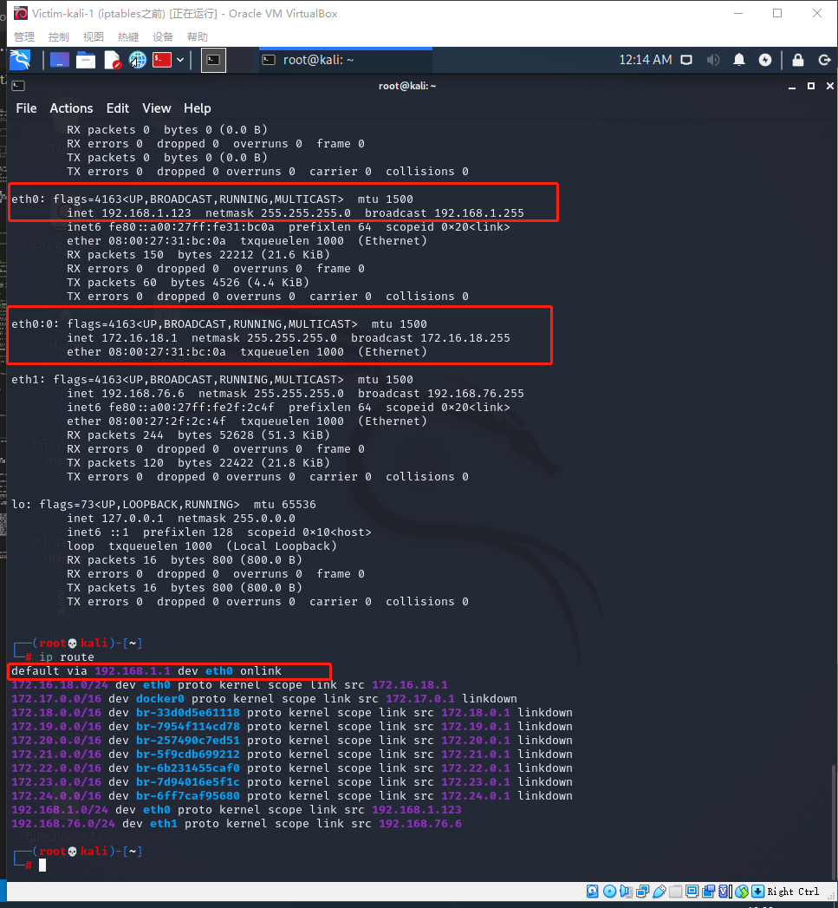

# 第八次实验

## 场景描述

局域网拓扑如下：

```
+----------------------+          +-------------------------+       +----------------------+     
|     host-1           |          |   host-2                |       |     host-3           |  
|     172.16.18.11     |          |   eth0:0 172.16.18.1    |       |     172.16.18.12     |  
|                      |          |   eth0: 192.168.1.123   |       |                      |  
+-------------+--------+          +----------+--------------+       +-------------+--------+  
              |                              |                                    |
              |                              |                                    |
     +--------+------------------------------+--+                                 |
     |                交换机                    |---------------------------------+
     +-----------------+------------------------+
                       |
                       |
                 +-----+-----------+
                 |   eth0          |   `
                 |   192.168.1.1   |
              +--+-----------------+---------+
              |                              |
              |        host-gw / dns-svr     |
              |                              |
              +------------------+----------++
                                 |  eth1    |
                                 +----------+
                                
```

上图的补充文字说明如下：

- host-gw 指的是该局域网的网关，已经配置为 NAT 方式，局域网内的主机 host-2 可以正常无障碍访问互联网；
- dns-svr 指的是该局域网中的 DNS 解析服务器，可以正常提供域名解析服务；
- 交换机没有设置 VLAN，所有端口正常工作；
- host-2上配置了 iptables规则；
- host-1上配置了默认网关指向 IP 地址：172.16.18.1，域名解析服务器配置为 IP：192.168.1.1
- host-3上配置了默认网关指向 IP 地址：172.16.18.1，域名解析服务器配置为 IP：192.168.1.1

## 实验任务要求

- [x] 请对以上脚本逐行添加代码注释
- [x] host-1可以ping通ip: 172.16.18.1吗？
- [x] host-1可以ping通ip: 192.168.1.1吗？
- [x] host-1可以ping通域名: www.baidu.com吗？
- [x] host-1可以访问： http://www.baidu.com 吗？
- [x] host-1可以访问：http://61.135.169.121 吗？
- [x] host-3可以ping通ip: 172.16.18.1吗？
- [x] host-3可以ping通ip: 192.168.1.1吗？
- [x] host-3可以访问互联网吗？

## 实验过程

host2 的 iptables [配置脚本](./configure-ipt.sh)

```bash
#!/bin/bash

IPT="/sbin/iptables"

# 删除表中所有规则
$IPT --flush
# 删除所有规则链
$IPT --delete-chain

# 定义默认策略
# 其中 INPUT链默认为DROP（丢弃），FORWARD链默认为DROP（丢弃），OUTPUT链默认为ACCEPT(接受)
$IPT -P INPUT DROP
$IPT -P FORWARD DROP
$IPT -P OUTPUT ACCEPT

# 创建新的用户自定义规则链forward_demo、icmp_demo
$IPT -N forward_demo
$IPT -N icmp_demo

# 在规则列表最后增加规则
# 接受本地回环网卡的输入与输出
$IPT -A INPUT -i lo -j ACCEPT
$IPT -A OUTPUT -o lo -j ACCEPT

# 对INPUT链执行过滤操作
# All TCP sessions should begin with SYN
# 丢弃所有新建立的并且没有设置syn标志位的tcp连接
# 简言之，所有TCP连接必须从syn包开始
$IPT -A INPUT -p tcp ! --syn -m state --state NEW -s 0.0.0.0/0 -j DROP
# 接受所有状态为ESTABLISHED,RELATED的连接
$IPT -A INPUT -m state --state ESTABLISHED,RELATED -j ACCEPT

# 对输入的所有使用icmp协议的数据包执行icmp_demo链中的过滤规则
$IPT -A INPUT -p icmp -j icmp_demo

# 向icmp_demo链追加规则，eth0接受使用icmp协议的数据包
$IPT -A icmp_demo -p icmp -i eth0 -j ACCEPT
# 防火墙将停止为数据包执行icmp_demo链中的下一组规则。控制将返回到调用链（INPUT链）。
$IPT -A icmp_demo -j RETURN

# 对转发的数据使用forward_demo链中的规则
$IPT -A FORWARD -j forward_demo

# 以下是在forward_demo链中追加规则
# 当数据包匹配上forward_demo链的规则，在日志中的log有特定前缀：FORWARD_DEMO
$IPT -A forward_demo -j LOG --log-prefix FORWARD_DEMO
# 丢弃掉使用tcp连接访问80端口并且使用bm方法匹配到'baidu'字符串的数据包（简单来说：http数据包中不能出现baidu这个字符串）
$IPT -A forward_demo -p tcp --dport 80 -m string --algo bm --string 'baidu' -j DROP
# 接受使用tcp协议的并且源地址为172.16.18.11这一ip地址的数据包
$IPT -A forward_demo -p tcp -s 172.16.18.11 -j ACCEPT
# 接受使用tcp协议的并且目的地址为172.16.18.11这一ip地址的数据包
$IPT -A forward_demo -p tcp -d 172.16.18.11 -j ACCEPT
# 接受172.16.18.11且目标端口为53的udp数据包（允许172.16.18.11进行dns解析）
$IPT -A forward_demo -p udp -s 172.16.18.11 --dport 53 -j ACCEPT
# 接受172.16.18.1且目标端口为53的udp数据包
$IPT -A forward_demo -p udp -s 172.16.18.1  --dport 53 -j ACCEPT
# 允许172.16.1.1进行dns解析
$IPT -A forward_demo -p udp -s 192.168.1.1  --sport 53 -j ACCEPT
# 允许172.16.18.1进行tcp连接
$IPT -A forward_demo -p tcp -s 172.16.18.1 -j ACCEPT
# 防火墙将停止为IP地址为172.16.18.1的数据包执行icmp_demo链中的下一组规则。控制将返回到调用链。
$IPT -A forward_demo -s 172.16.18.1 -j RETURN


# 指定nat表中的POSTROUTING链，添加规则
# 为172.16.18.0/24，这个网络开启NAT转发，动态分配IP地址
$IPT -t nat -A POSTROUTING -s 172.16.18.0/24 -o eth0 -j MASQUERADE

```

**注意，最后一行，为网段进行nat转换，应写为172.16.18.0/24**

### 环境搭建

由于在本实验中Host1和3的作用是一样的，所以只使用一台虚拟机Host1进行演示

- host-gw / dns-svr ：**kali-2019**
  - eth0 ：NAT(NAT网络)
    - 10.0.2.15/24
  - eth1 : intnet1(内部网络)
    - 192.168.1.1/24  
- host1 : **Victim-XP-1**
  - Ethernet Adapter : intnet1(内部网络)
    - 172.16.18.11/24
- host2 : **Victim-Kali-1**
    - eth0 : intnet1(内部网络)
      - 192.168.1.1/24
    - eth0:0 : intnet1(内部网络)
      - 172.16.18.1/24

**网络拓扑**


#### 网关

eth0用于和互联网进行连接，eth1用于和内部网络进行连接


- 开启dns服务

安装bind9进行dns解析`sudo apt install bind9`

想起用bind9的服务，`systemctl start bind9`

但是显示没有bind9这一服务，于是去查找`dpkg -L bind9`

在所有结果中发现了这一条：`/lib/systemd/system/named.service`

说明需要使用这个命令: `systemctl start named.service` 来开启dns服务

- 配置iptables

由于host1需要经过host2之后再经过网关才能访问互联网，所以需要在网关这里配置nat

```
iptables-save -c > iptables.rules
```

将规则保存在iptables.rules中，然后在nat表中添加规则：
```
-A POSTROUTING -s 192.168.1.0/24 ! -d 192.168.1.0/24 -o eth0 -j MASQUERADE
-A POSTROUTING -s 172.16.18.0/24 ! -d 172.16.18.0/24 -o eth0 -j MASQUERADE
```

对192.168.1.0/24和172.16.18.0/24网段进行nat转换


#### Host1

配置静态ip，子网掩码，网关与dns


#### Host2

- 临时性为网卡加入新的IP地址:

```
ifconfig eth0:0 172.16.18.1 netmask 255.255.255.0 up
```

关于eth0:0的解释：

```
eth0 eth0:1 和eth0.1
三者的关系对应于物理网卡、子网卡、虚拟VLAN网卡的关系：

子网卡：子网卡在这里并不是实际上的网络接口设备，但是可以作为网络接口在系统中出现，如eth0:1、eth1:2这种网络接口。它们必须要依赖于物理网卡，虽然可以与物理网卡的网络接口同时在系统中存在并使用不同的IP地址，而且也拥有它们自己的网络接口配置文件。但是当所依赖的物理网卡不启用时（Down状态）这些子网卡也将一同不能工作。

虚拟VLAN网卡：这些虚拟VLAN网卡也不是实际上的网络接口设备，也可以作为网络接口在系统中出现，但是与子网卡不同的是，他们没有自己的配置文件。他们只是通过将物理网加入不同的VLAN而生成的VLAN虚拟网卡。如果将一个物理网卡通过vconfig命令添加到多个VLAN当中去的话，就会有多个VLAN虚拟网卡出现，他们的信息以及相关的VLAN信息都是保存在/proc/net/vlan/config这个临时文件中的，而没有独自的配置文件。它们的网络接口名是eth0.1、eth1.2这种名字。
```


- 开启ipv4转发：

```
Linux系统缺省并没有打开IP转发功能，要确认IP转发功能的状态，可以查看/proc文件系统，使用下面命令： 

cat /proc/sys/net/ipv4/ip_forward

如果上述文件中的值为0,说明禁止进行IP转发；如果是1,则说明IP转发功能已经打开。

要想打开IP转发功能，可以直接修改上述文件： echo 1 > /proc/sys/net/ipv4/ip_forward

把文件的内容由0修改为1。禁用IP转发则把1改为0。

上面的命令并没有保存对IP转发配置的更改，下次系统启动时仍会使用原来的值，要想永久修改IP转发，需要修改`/etc/sysctl.conf`文件，修改如下： `net.ipv4.ip_forward = 1` 

修改后可以重启系统来使修改生效，也可以执行下面的命令来使修改生效： `sysctl -p /etc/sysctl.conf` 进行了上面的配置后，就能一直开启IP转发功能了。
```

- 执行配置iptables的脚本


然后和配置网关的方法一样，为172.16.18.0/24这个网络进行nat转换

host2的网卡情况：




### 问题回答

1. host-1可以ping通ip: 172.16.18.1吗？

> **可以**
> host1发送icmp数据包---INPUT链---icmp_demo链---接受


2. host-1可以ping通ip: 192.168.1.1吗？

> **不可以**
> host1发送icmp数据包---FORWARD链---在forward_demo中没有与这一数据包相匹配的规则---按照默认规则丢弃


3. host-1可以ping通域名: www.baidu.com吗？

> **不可以**

host1会先对www.baidu.com进行域名解析

> host1经过host2向2网关发送udp数据包---FORWARD链---forward_demo链---目标端口53---ACCEPT
> 网关响应udp数据包---FORWARD链---forward_demo链---源端口为53---ACCEPT

然后向百度发送icmp数据包

> host1发送icmp数据包---FORWARD链---forward_demo中禁止数据包含有baidu这一字符串---丢弃


如图所示，可以正常进行dns解析，在日志中可以看到host2进行了转发，但是抓包没有抓到，是因为防火墙已经在抓包之前对数据包进行了拦截。

4. host-1可以访问： http://www.baidu.com 吗？


> **不可以**

host1会先对www.baidu.com进行域名解析

> host1经过host2向2网关发送udp数据包---FORWARD链---forward_demo链---目标端口53---ACCEPT
> 网关响应udp数据包---FORWARD链---forward_demo链---源端口为53---ACCEPT

> host1发送tcp数据包---FORWARD链---forward_demo中禁止数据包含有baidu这一字符串---丢弃

5. host-1可以访问：http://61.135.169.121 吗？


> **可以**

> host1发送tcp数据包---FORWARD链---forward_demo链---发送的数据包中没有baidu这一字符串---ACCEPT

> 网关请求目标网址成功后，转发数据到host2---FORWARD链---forward_demo链---ACCEPT

6. host-1可以访问互联网吗？

> **可以**

> 但是如果再配置一台host-3就不可以了，因为host3的ip地址没有被添加到forward_demo链中，会被默认规则处理，而默认规则是drop，所以host1可以访问互联网，host3不可以


数据包流向和之前类似

## 总结

网络连通性是很多工作的基础，所以修复网络连通性是很重要并且必要的一项技能。这次实验让我深刻了解到了网络金字塔模型环环相扣，网络连通性的修复是一环扣一环的，并且是有据可依的，一个环节配置不好就无法使网络连通,我就因为一些关键环节不重视，导致卡住了好多个小时。由远及近，一步一步检查每一个环节是检查网络连通性的重中之重。

## 参考资料
- [eth0 eth0:1 eth0.1 的区别](https://www.itread01.com/content/1532584951.html)
- [Iptables String Matching for Advanced Firewalling.](http://wiztelsys.com/Article_iptables_bob2.html)
- [explainshell](https://explainshell.com/)
- [2018-NS-Public-jckling](https://github.com/CUCCS/2018-NS-Public-jckling)